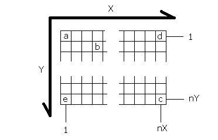

# Lambda 2.0

simon.ahrens at stud.fh-oldenburg.de
matthias.blau at fh-oldenburg.de
marco.ruhland at stud.fh-oldenburg.de
[www.hoertechnik-audiologie.de](www.hoertechnik-audiologie.de)

## Contents

1. [Installation][]  
	1.1 [Installing the prebuilt binaries][]  
		1.1.1 [Linux][linbin]  
		1.1.2 [Windows][winbin] 
	1.2	Building from source
		1.2.1 Linux 
		1.2.2 Windows
		1.2.3 OSX
		
2. Simulation input
	2.1 Overview
	2.2 Sim files
	2.3 Using the scripts
	2.4 Geometry and coordinate conventions
	
3. Using Lambda
	3.1 

# 1. INSTALLATION [Installation] #

You can either run the prebuilt binaries from this package or make your own build from the source, especially if the prebuilt executable generates problems on your machine.

## 1.1 Installing the prebuilt binaries

### 1.1.1 Linux [linbin]

Required packages:

	libc6 version 2.4 or higher
	
If you have the Linux package (suffix "glx"), simply extract the contents of "bin" to "/usr/bin/". Extract the directories "examples", "doc" and "scripts" to your file system if you intend to use them. 

### 1.1.2 Windows [winbin]

If you have the Windows package (suffix "w32"), extract the contents of "bin" from the zipped archive to a path of choice, e.g. "C:\Lambda". Extract the directories "examples", "doc" and "scripts" to the same directory if you intend to use them. 

## 1.2 Building from source

### 1.2.1 Linux
Required packages:

	libQt4-core
    libQt4-debug
    libQt4-debug-dev
    libQt4-dev
    gcc, g++ (or any other C++ compiler)
	
Extract the archive to your file system. Go to the location you extracted it to and cd into the "src" directory. Run

	qmake
	
Once qmake is finished, run

	make
	
You should now have the lambda executable in the "src" directory. 

### 1.2.2 Windows
Required software:

	Trolltech Qt 4
	
Extract the archive to your file system. Go to the location you extracted it to and cd into the "src" directory. Run

	qmake
	
Once qmake is finished, run

	make
	
You should now find the executable in the "release" directory. Now, copy the QT libraries `QtCore4.dll` and `QtGui4.dll` to that directory. Also copy `mingwm10.dll` to that directory (all these .dll files can are also provided in the bin directory of the lambda w32 package).

Since compiling the AVI encoder creates a lot of problems on Windows machines, the Windows version of Lambda compiles without this feature in the standard configuration. If you intend to compile with the AVI encoder, open lambda.pro in a text editor and replace `lambda_noAVI.h` in the `HEADERS` line with `lambda.h` and replace `lambda_noAVI.cpp` in the `SOURCES` line with `lambda.cpp`. Then, open main.cpp in a text editor and replace `lambda_noAVI.h` in the #include line with lambda.h and run qmake and make again.

### 1.2.3 OSX (Macports) >= 10.6
Required software:

	Trolltech Qt 4
	revel (>= 1.1.0)
	
Via `port install` install the following packages

	X11
	XviD
	
Compile and install revel. If you installed libxvid via macports, you need to include the path (opt/local/include by default)

	$ export CFLAGS="-I/opt/local/include -I/usr/include/malloc"
	$ ./configure
	$ make
	$ sudo make install
	
Modify the following lines in src/lambda.pro to match your system. An Example:

	INCLUDEPATH += . /opt/X11/include/X11 /usr/include/malloc /opt/local/include
	LIBS += -L. -lrevel -lxvidcore -lX11 -L/opt/X11/lib -L/opt/local/lib
	
Now run qmake

	qmake
	
This will generate an XCode project (`lambda.xcodeproj`). Open it and compile it. In src you should have now a new folder `build` with a `lambda.app` inside. First launch `X11` (`XQuartz`) and then open the app.

#  2. SIMULATION INPUT 

##  2.1 Overview 
To run a simulation, Lambda must be provided with information about the simulated environment. Most of this information can be fed into Lambda in binary sim files containing certain data in a certain structure described below. The easiest way to create sim files is to use the included scripts for Scilab (freeware) and Matlab.
The new version 2.0 of Lambda offers new features like frequency dependent boundary conditions and velocity sources. Since these features require some definitions that the old sim file format could not offer, a new sim file format had to be introduced. Unfortunately, **this means that the actual version 2.0 is no longer compatible to older sim files which have been generated for the usage with Lambda 1.2! But you can use the script "converter.m" or "converter.sce" to transform your old 1.x sim files into the new 2.0 format. This script is delivered in the "scripts" folder.** The new sim file format is divided into a header and several data chunks which are explained in the following paragraphs.

##  2.2 Sim files 
The structure of sim files is as follows:

**HEADER**
: A string of 12 characters, containing the text "LAMBDASIM200". This indicates that the sim file is of the new 2.0 format.  

**DEF chunk**
: This is a data chunk that contains some important simulation conditions. The header must always be follow by the DEF chunk. It is built up as follows:

Item     | Type                  | Description  
-------- | --------------------- | ----------------------------- 
Chunk ID | 3 unsigned characters | containing the string "DEF" as identifier  
YSIZE    | double value          | size of simulation area in Y-direction (number of rows) in pixels  
XSIZE    | double value          | size of simulation area in X-direction (number of columns) in pixels  
STEPS    | double value          | number of discrete time samples to simulate (0=infinite)  
C        | double value          | sound propagation speed in the simulation area in m/s  
L        | double value          | real world length of a single square node im m  
RHO      | double value          | density of the medium in kg/m^3
         |                       | (air=1,204 kg/m^3) (needed for velo sources)  

**ENV chunk**
: This chunk contains the physical layout of the simulation environment in a 2-dimensional matrix. The DEF chunk must always be followed by the ENV chunk.

Item     | Type               | Description  
-------- | ------------------ | ------------------------
Chunk ID | 3 unsigned chars   | containing "ENV" as identifier  
ENVI     | double-valued 2-dim matrix of the size YSIZE*XSIZE as defined in the DEF chunk | Each value in this matrix defines the properties of a pixel or "node" in the simulation environment. There are four possible behaviours for a node, which are encoded within this value as follows:  
         |                    | 0: Node is empty space (air)
		 |                    | [-1...+1] excluding 0: Node is reflecting wall, value defines the degree of reflexion (r) where 1 is 100% reflextive. Negative values cause a phase shift of 180°
		 |                    | < -1 : Indicates a receiver node. this node type behaves like empty space (air), but by clicking the Rec checkbox in Lambda, the node's pressure data will be recorded in a .rce-file
		 |                    | > 1 [2, 3, 4, ...]  This indicates a frequency dependent reflective node. The value should be rounded numbers. These numbers are filter IDs for digital filters that can be specified in the optional FLT chunk.
		 
**ANG chunk**  
This chunk contains a 2-dimensional matrix that can be filled up with angle values which indicate either the normal angle of reflective (optional) walls or the angle of incidence for velocity sources. Therefore, some physical properties of this simulation type shall be explained:  

If you bild up a reflective wall in the ENV matrix, for example with a reflection coefficient of `r=0.4`, then you need to know that, depending on the normal angle of the wall, the actual reflection coefficient differs from the one you have chosen (for normal incidence). In fact, `r` will only be correct on walls that have a normal angle of 45 degrees
	
		desired r = 0.4        desired r = 0.4         desired r=0.4

		normal angle = 0°      normal angle=30°       normal angle=45°
		
	      x                            x                           x
		  x                            x                          x
		  x                           x                          x
		  x                           x                         x 
		  x                          x                         x
		  x                          x                        x 
		  x                         x                        x
		  x                         x                       x
		  
		 measured r = 0.245!!    measured r = 0.338!!    measured r=0.4 
		                                                 (correct)

To avoid this error, Lambda 2.0 offers the possibility to "preemphase" the reflection coefficients (and also the coefficients of digital filters), so that walls, which are assembled of many nodes like shown above, behave correctly. For this it is necessary to tell Lambda for each node, that the node belongs to a wall with a normal angle `alpha`, which can be in a value between -360 and +360 degrees.  
For example, for the 30° wall with r = 0.4, the ENV-matrix and the ANG-matrix should look like this:  

		ENV matrix                    ANG matrix
		0.0  0.0  0.0  0.4  0.0       0   0   0  30   0
		0.0  0.0  0.0  0.4  0.0       0   0   0  30   0
		0.0  0.0  0.4  0.0  0.0       0   0  30   0   0
		0.0  0.0  0.4  0.0  0.0       0   0  30   0   0
		0.0  0.4  0.0  0.0  0.0       0  30   0   0   0 
		0.0  0.4  0.0  0.0  0.0       0  30   0   0   0
		
Then the reflection factors will be preemphased so that this wall really reflects with a correct value of 0.4 for normal incidence.  
And not only the real-valued reflection coefficients, but also the digital filters will be preemphased to work correctly.  
  
**If you do not want this preemphasis to be made, you can either leave out the complete ANG data chunk, or fill the ANG matrix with values which are out of the angle range (out of -360...+360°, for example 400).**
  
For velocity sources, the angles in this matrix specify the prefered direction of scattering for that source. The velocity of a velo source results in a pressure (depending on rho and propagation speed c). This pressure will be adjusted correctly by the desired angle of scattering for the velo source. See the example scripts for details.
		
Item     | Type               | Description  
-------- | ------------------ | ------------------------
Chunk ID | 3 unsigned chars | containing the string "ANG" as identifier
ENVIANG  | double-valued 2-dim matrix of the size YSIZE*XSIZE as defined in the DEF chunk | Each value in this matrix defines the preemphasis angle for a pixel or "node" in the simulation environment, like explained above. The complete "ANG" chunk can be left out if no preemphasis shall be done.

**FLT chunk** (optional)
: This chunk contains the coefficients of digital filters, if you want to define any. Each digital filter must have an own ID number. You can assign a filter to a node by writing the filter ID into the ENV-matrix, instead of a real-valued reflection coefficient. If you do not want to specify digital filters, the complete FLT chunk can be left out. In this case, all eventual filter IDs in the ENV-matrix will be assigned to a standard-zero-reflection filter. In Lambda, a digital filter transfer function is defined in the form:

		       b0 + b1*z^-1 + b2*z^-2 + ... + bn*z^-n
		H(z) = --------------------------------------
		       a0 + a1*z^-1 + a2*z^-2 + ... + an*z^-n
			   
Item         | Type             | Description  
------------ | ---------------- | ----------------------------------
Chunk ID     | 3 unsigned chars | containing the string "FLT" as identifier  
NUMFILTERS   | double value     | total number of digital filters defined in this chunk  
FILTER ID #1 | double value     | should be a rounded number (e.g. "2") as filter ID number  
NA #1        | double value     | number of "a"-coefficients of filter #1  
NB #1        | double value     | number of "b"-coefficients of filter #1  
a0 #1        | double value     | filter #1: first a-coefficient a0  
a1 #1        | double value     | filter #1: second a-coefficient a1  
...          | ...              | ...and so on  
aNA #1       | double value     | filter #1: last a-coefficient  
b0 #1        | double value     | filter #1: first b-coefficient b0  
b1 #1        | double value     | filter #1: second b-coefficient b1  
...          | ...              | ... and so on  
bNB #1       | double value     | filter #1: last b-coefficient  
FILTER ID #2 | double value     | ID number of the next digital filter (if any; e.g. "3")  
NA #2        | double value     | number of "a"-coefficients of filter #2  
NB #2        | double value     | number of "b"-coefficients of filter #2  
a0 #2        | double value     | filter #2: first a-coefficient a0  
a1 #2        | double value     | filter #2: second a-coefficient a1  
...          | ...              | ... and so on  
aNA #2       | double value     | filter #2: last a-coefficient  
b0 #2        | double value     | filter #2: first b-coefficient b0  
b1 #2        | double value     | filter #2: second b-coefficient b1  
...          | ...              | ... and so on  
bNB #2       | double value     | filter #2: last b-coefficient  
...          | ...              | ...  
...          | ...              | ... and so on, until NUMFILTERS filters are specified.  

**SRC chunk**
: This chunk contains a vector defining the sonic sources in the simulation. A source can either be a pressure source or a velocity source. There are several source types available in Lambda 2.0. The SRC chunk must be the last chunk in a simfile.

Item        | Type                  | Description  
----------- | --------------------- | ------------------------------------  
Chunk ID    | 3 unsigned characters | containing the string "SRC" as identifier  
NUMSOURCES  | double value          | number of sources defined in this chunk  
SRC#1 YPOS  | double value          | Y-Position of source #1 in the environment  
SRC#1 XPOS  | double value          | X-Position of source #1 in the environment  
SRC#1 TYPE  | double value          | Specifies the type of source #1 (see below for type numbers)  
SRC#1 AMP   | double value          | Amplitude of source #1 in Pascal (Pa) for pressure sources, or in m/s for velocity sources  
SRC#1 FREQ  | double value          | Frequency of source #1 (without effect for pulse sources)  
SRC#1 PHASE | double value          | Phase offset of source #1 in degrees  
SRC#2 YPOS  | double value          | Y-Position of source #2 in the environment  
SRC#2 XPOS  | double value          | X-Position of source #2 in the environment  
SRC#2 TYPE  | double value          | Specifies the type of source #2 (see below for type numbers)  
SRC#2 AMP   | double value          | Amplitude of source #2 in Pascal (Pa) for pressure sources, or in m/s for velocity sources  
SRC#2 FREQ  | double value          | Frequency of source #2 (without effect for pulse sources)  
SRC#2 PHASE | double value          | Phase offset of source #2 in degrees  
...         | ...                   | ... and so on, until NUMSOURCES sources are specified.  

Supported source types are  
  
    	1   sinusoidal source (pressure source)  
    	2   square source / rectangular (pressure source)
		3   delta pulse source (pressure source; 
		    freq and phase have no effect on this source)
		4   exponential decay source 
		    (pressure source; NOT WORKING CORRECTLY YET!!!)
		5   Hann-Windowed sinusoidal source (pressure source)
		
		6   sinusoidal source (velocity source)
        7   square source / rectangular (velocity source)
        8   delta pulse source (velocity source; 
		    freq and phase have no effect on this source)
        9   exponential decay source (velocity source; 
			NOT WORKING CORRECTLY YET!!!)
        10  Hann-Windowed sinusoidal source (velocity source)
		
Be aware that the velocity sources in this simulation are not real velocity sources. They are only an adaption. Lambda does only calculate pressure values, it has got no velocity layer. So the velocity sources in this simulation transform their actual velocity into a pressure, and therefore their behaviour is much like pressure sources. But they allow you to specify a velocity amplitude, and not a pressure amplitude like the pressure sources. A constant velocity amplitude results in a pressure amplitude which is dependent of frequency, desired angle of scattering, and air density.

## 2.3 Using the scripts
There is no difference in the usage of the included Scilab and Matlab scripts "createsim.sce" and "createsim.m". To create a sim file, begin with setting a name for the sim file. Just edit the variable FILENAME.
Edit the values for the size of the simulation area, XSIZE and YSIZE next, followed by the desired number of simulation steps (STEPS), the wave propagation speed C in m/s and the simulated length of each node in the simulation L in meters.
The next line creates a YSIZE x XSIZE sized matrix called ENVI, filled with zeros. This matrix represents the simulation environment. Go ahead and edit the matrix so that it represents exactly the environment you would like to simulate.
The last step in setting up a sim file is to define sources. for each source, create a 1 x 6 vector containing the source's Y-coordinate, X-coordinate, type, amplitude, frequency and phase shift in this very order. Once you are done, concatenate all source vectors to the vector SOURCES.
Now you are done configuring the simulation, just execute the script and it will create the sim file at the path you specified in the file name.
There are two more scripts, "readrce.sce" and "readrce.m", that read receiver output into Matlab or Scilab. Just enter the file name of the .rce file and execute the script. After the execution, your workspace will contain a vector REC containing each receiver's output in a single column.

If you want to use the more advanced techniques like digital filters etc., see the according example scripts.

## 2.4 Geometry and coordinates conventions
This image demonstrates the conventions for coordinates in Lambda:

Coordinates are always in format (Y,X), so in this example, b is at (2,4).
a represents (1,1), c is at (YSIZE,XSIZE), d is (1,XSIZE) and e is at position (YSIZE,1).

#  3. USING LAMBDA 

##  3.1 Command line options 
Lambda offers some useful command line options to enable users to automize the simulation routines. With these options it is possible to configure and run Lambda from an external script so that no clicking or manual interference is necessary.

### 3.1.1 Linux and OSX
	-file <filename>		Loads the specified file upon startup and starts the simulation 
							as soon as all input arguments have been processed.
							Example: ./lambda -file example.sim

	-contrast <value>		Sets the visualization contrast to the provided value. 
							Contrast ranges from 0 to 100, Lambda's standard setting is 50.
							Example: ./lambda -contrast 75

	-zoom <value>			Sets the visualization zoom to the provided value. 
							Zoom ranges between 1 and 999. .avi video output will not be
							encoded zoomed. Use the zoom function of your player for zooming 
							.avi videos. Lambda's standard setting is 1.
							Example: ./lambda -zoom 2

	-skip <value>			Sets the amount of images to skip in the visualizaton.
		 					This feature allows to reduce impact on CPU usage. 
							Ranges between 0 and 999 images, Lambda's standard setting is 0.
							Example: ./lambda -skip 3

	-quality <value>		Sets the graphics quality for the avi encoder. 
							Ranges from 1 to 100 (percent), Lambda's standard setting is 100.
							Example: ./lambda -quality 25

	-iterations <value>		Sets the amount of simulation iterations or discrete time steps.
		 					Ranges from 0 to 99999, where 0 means an infinite amount 
							(simulation will continue until stopped manually).
							Lambda's standard setting is 0.
							Example: ./lambda -iterations 0

	-vis					Switches on Lambda's visualization mode on startup.
							Example: ./lambda -vis

	-avi					Switches on Lambda's avi encoder on startup. 
							Video output will be written to hard disk into a file with 
							the same name like the simulation file and .avi extension, 
							once a simulation is started.
							Example: ./lambda -avi

	-rce					Switches on Lambda's receiver mode on startup. 
							In this mode, sound pressure data at the user defined 
							receiver nodes will be saved to hard disk an a .rce file. 
							A maximum of 10.000 data points per receiver is allowed 
							in this version.
							Example: ./lambda -rce

	-rco					Switches on Lambda's recorder creating rco files. 
							These files contain all the simulation's pressure data and 
							can be opened and replayed in Lambda in later sessions. 
							To protect your system from running out of memory, 
							a maximum of 500 frames can be recorded.
							Example: ./lambda -rco

	-walls					Switches on Lambda's wall and receiver visualization on startup 
							(this only makes sense if the -vis option is also set). 
							This option is new in Lambda 2.0.
							
	-exit 					This option tells Lambda to terminate itself after the final 
							number of iterations is reached. 
							This is very useful for batch processing of multiple simulations. 
							However, if a simulation's final number of iterations is set to 0 
							(infinite), the -exit option has no effect because the end of the 
							simulation will never be reached.
							This option is new in Lambda 2.0.

All arguments can be combined together, calling order is irrelevant. 

	$ ./lambda -file example.sim -quality 50 -iterations 1000 -avi   
	
### 3.1.2 Windows
TODO

